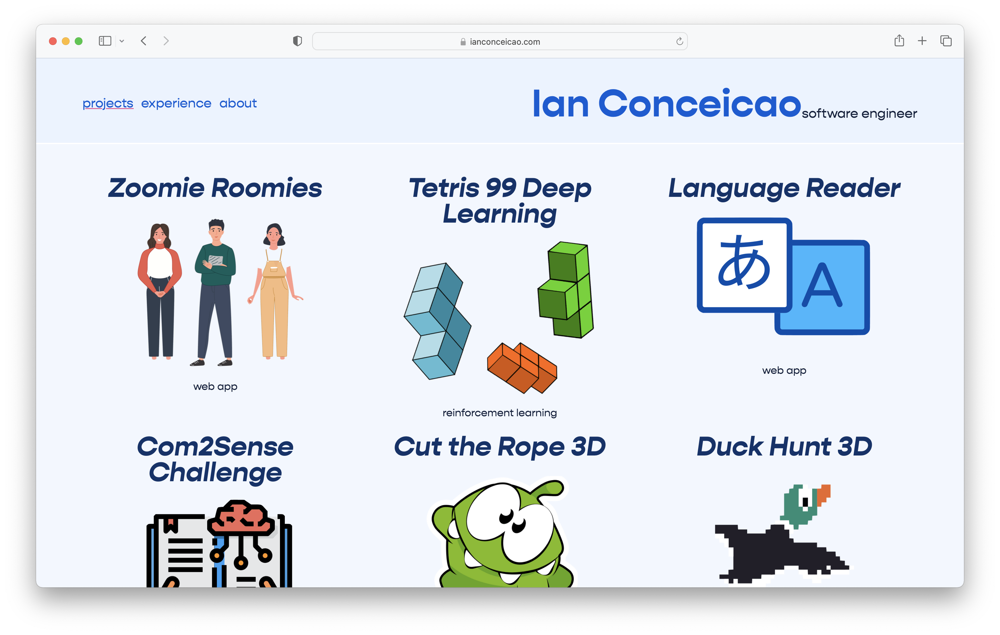
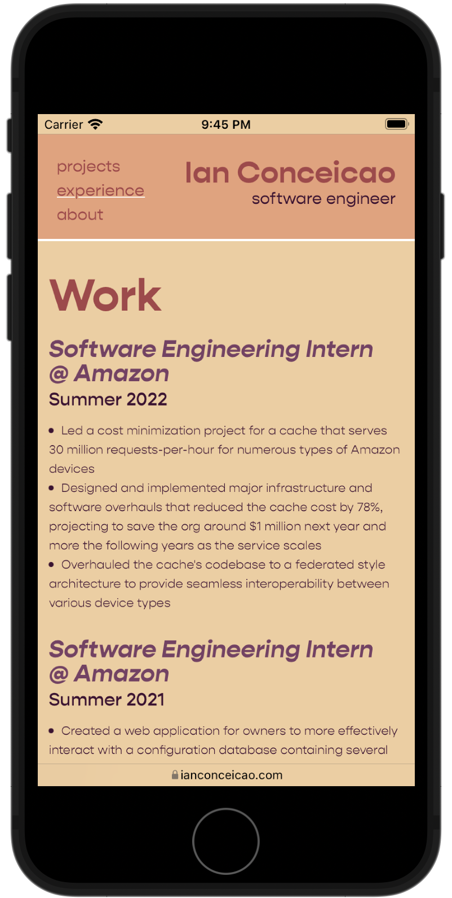
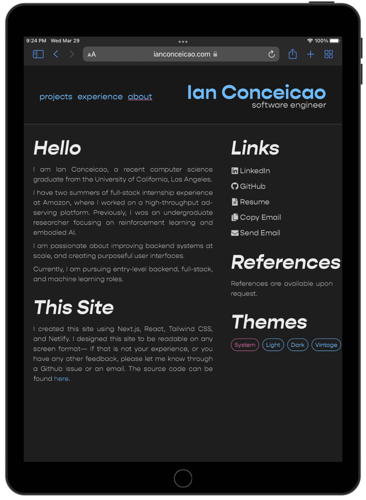

# Ian's Portfolio Website

<p align="center">
<a href="https://ianconceicao.com" target="__blank">

</a>
<a href="https://ianconceicao.com" target="__blank">
IanConceicao.com
</a>
</p>

## Purpose

This website showcases some of my projects, work experience, and other information about myself. Throughout making the website I enjoyed learning more about visual design and the latest website styling tools.

## Tech Stack

- Dev Framework: `Next.js`
- UI Framework: `React`
- Styling Framework: `Tailwind CSS`
- Deployment: `Netlify` and `Google Domains`

## Mobile Friendly

The site was designed to work on all screen sizes, including mobile. It uses flexboxes, columns, and breakpoints to deliver a great experience on any screen.

<p align="center" float="left">
<a href="https://ianconceicao.com/projects" target="__blank">
   
  </a>
   <a href="https://ianconceicao.com/projects" target="__blank">
  
  </a>
</p>

## Themes

The site offers 4 different theme choices. Light, Dark, Vintage and System. The System theme toggles between light and dark automatically depending on whether the user is in dark mode on their device. The theme can be changed on the about page.

<p align="center" float="left">
<a href="https://ianconceicao.com/experience" target="__blank">
   
  </a>
<a href="https://ianconceicao.com/about" target="__blank">
   
  </a>
</p>

## Dev Guide

### Prerequisites

### Setup

1. **Install mise for runtime version management** (if not already installed):

   ```bash
   brew install mise
   ```

2. **Install the required Node.js version**:

   ```bash
   mise install
   ```

   This will automatically install the Node js version specified in `mise.toml`.

3. **Install project dependencies**:

   ```bash
   npm install
   ```

4. **Set up git hooks** (automatically runs after `npm install`):
   ```bash
   npm run prepare
   ```

### Development

Start the development server:

```bash
npm run dev
```

The site will be available at `http://localhost:3000`.

### Build

Build the production-ready application:

```bash
npm run build
```

Start the production server:

```bash
npm start
```

### Other Configs

- **Linting**: Code is automatically linted via ESLint (configured in `.eslintrc.json`)
  - Check for linting errors: `npx eslint .`
  - Auto-fix linting errors: `npx eslint --fix .`
- **Formatting**: Code is automatically formatted via Prettier (configured in `.prettierrc.json`)
  - Check formatting: `npx prettier --check .`
  - Format all files: `npx prettier --write .`
- **Type Checking**: TypeScript type checking
  - Run type check: `npx tsc --noEmit`
- **Git Hooks**: Husky runs lint-staged on pre-commit to ensure code quality
