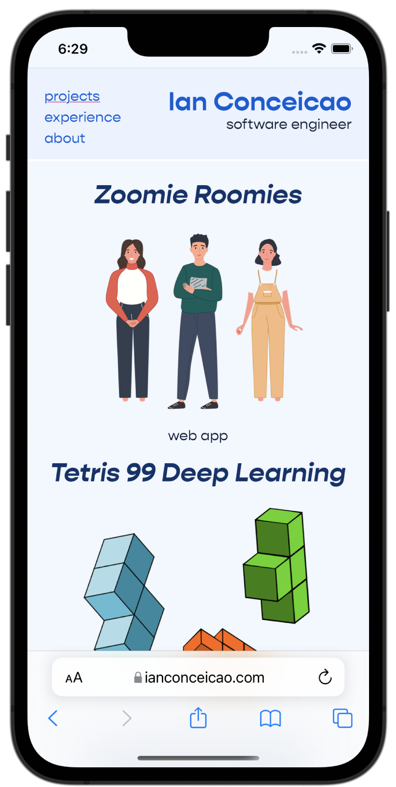
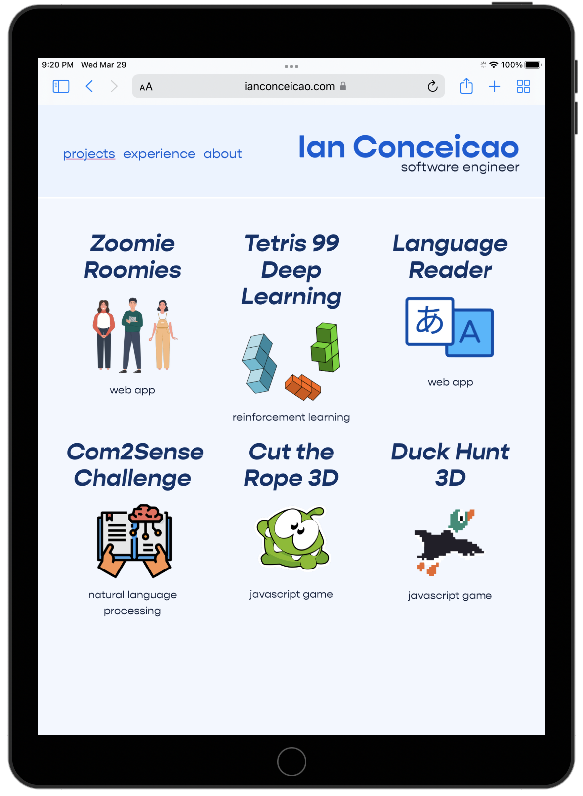

# Ian's Portfolio Website

<a href="https://ianconceicao.com">
IanConceicao.com
</a>

## Purpose

This website showcases some of my projects, work experience, and other information about myself. Throughout making the website I enjoyed learning more about visual design and the latest website styling tools.

## Tech Stack

- Dev Framework: `Next.js`
- UI Framework: `React`
- Styling Framework: `TailWind CSS`
- Deployment: `Netlify` and `Google Domains`

## Mobile Friendly

The site was designed to work on all screen sizes, including mobile. It uses flexboxes, columns, and breakpoints to deliver a great experience on any screen.

   

## Themes

The site offers 4 different theme choices. Light, Dark, Vintage and System. The System theme toggles between light and dark automatically depending on whether the user is in dark mode on their device. The theme can be changed on the about page.

